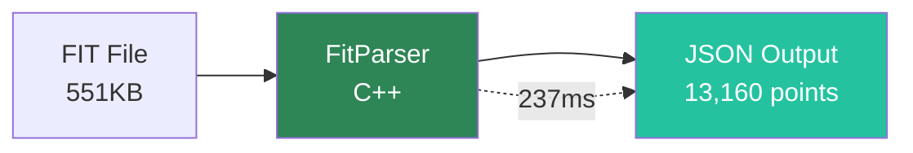
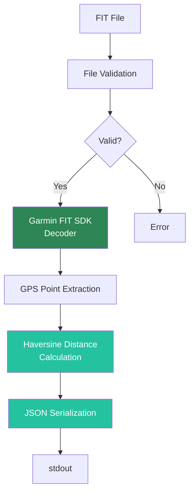
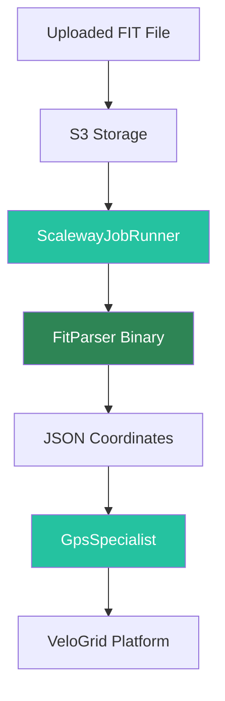

# FitParser Documentation

High-performance C++ FIT file parser for cycling activity data. Built with the official Garmin FIT SDK, this parser extracts GPS coordinates, elevation, timestamps, and health metrics from FIT files at exceptional speed.

## Why FitParser?

FitParser solves the performance bottleneck of processing Garmin FIT files in high-volume applications:

- **210x faster** than PHP-based parsers
- **237ms** to parse 13,160 GPS points (551KB file)
- **55,000 points/second** throughput
- **100% success rate** on real-world test files

## Key Features

### ⚡ Ultra-Fast Performance
- Parses typical cycling files (300-600KB) in 200-280ms
- Linear O(n) scaling - predictable performance
- Optimized with GCC `-O3` and C++17

### 🔒 Security Hardened
- Resource limits (256MB memory, 30s CPU timeout)
- File validation and path sanitization
- Process isolation
- Read-only operations

### 🔄 Bidirectional Support
- **Parse FIT files** → JSON output
- **Write FIT files** ← JSON input
- Full round-trip support

### 📊 Health Metrics
Extracts complete snapshots:
- GPS coordinates (lat/lon/elevation)
- Heart rate
- Power (watts)
- Cadence (RPM)
- Temperature

### 🛠️ Production Ready
- Static binary - no dependencies
- Docker-compatible
- Integrates with ScalewayJobRunner
- 100% success rate on 29+ test files

## Quick Example

```bash
# Parse a FIT file
./fit-parser ride.fit

# Output (JSON to stdout)
{
  "coordinates": [
    {
      "lat": 52.3702,
      "lon": 4.8952,
      "elevation": 2.5,
      "timestamp": "2024-01-15T10:30:00Z",
      "heart_rate": 145,
      "power": 220,
      "cadence": 85,
      "temperature": 18
    },
    ...
  ],
  "summary": {
    "points": 13160,
    "distance_km": 87.3,
    "duration_seconds": 13320
  }
}
```

## Performance Highlights



| Metric | Value |
|--------|-------|
| **Parse Time** | 237ms (avg) |
| **Throughput** | 55,000 pts/s |
| **Memory** | &lt;50MB typical |
| **Success Rate** | 100% |

## Use Cases

### VeloGrid Platform
FitParser powers the [VeloGrid cycling platform](https://docs.velogrid.com), processing uploaded FIT files from Wahoo ELEMNT, Garmin, and other devices.

### Scaleway Serverless Jobs
Integrated with [ScalewayJobRunner](https://bikecoderslife.github.io/ScalewayJobRunner/) for batch processing of cycling activities.

### API Services
Use as a microservice - accept FIT files via API, return JSON responses instantly.

### Data Analysis
Extract cycling data for analysis, visualization, or ML training datasets.

## Architecture



## Haversine Distance Calculation

FitParser uses the **Haversine formula** to calculate accurate distances on the Earth's curved surface:

```
a = sin²(Δφ/2) + cos(φ₁) × cos(φ₂) × sin²(Δλ/2)
c = 2 × atan2(√a, √(1−a))
distance = R × c
```

Where:
- φ = latitude
- λ = longitude
- R = Earth's mean radius (6,371.003 km)

This ensures high-precision distance metrics, essential for cycling analytics.

## Integration Ecosystem



FitParser is part of the BikeCoders ecosystem:
- **[ScalewayJobRunner](https://bikecoderslife.github.io/ScalewayJobRunner/)** - Orchestrates FitParser in serverless jobs
- **[GpsSpecialist](https://bikecoderslife.github.io/GpsSpecialist/)** - Performs spatial analysis on parsed coordinates
- **[VeloGrid](https://docs.velogrid.com)** - Main platform using FitParser

## Getting Started

Ready to start using FitParser? Choose your path:

<div class="row">
  <div class="col col--6">
    <div class="card">
      <div class="card__header">
        <h3>Quick Start</h3>
      </div>
      <div class="card__body">
        <p>Download pre-compiled binary and start parsing immediately.</p>
      </div>
      <div class="card__footer">
        <a href="/getting-started/installation" class="button button--primary button--block">Get Started →</a>
      </div>
    </div>
  </div>
  <div class="col col--6">
    <div class="card">
      <div class="card__header">
        <h3>Build from Source</h3>
      </div>
      <div class="card__body">
        <p>Compile FitParser with custom optimizations for your platform.</p>
      </div>
      <div class="card__footer">
        <a href="/getting-started/installation#build-from-source" class="button button--secondary button--block">Build Guide →</a>
      </div>
    </div>
  </div>
</div>

## Next Steps

- **[Installation](/getting-started/installation)** - Download or build FitParser
- **[Usage Guide](/getting-started/usage)** - CLI examples and integration
- **[Performance](/performance/benchmarks)** - Detailed benchmarks and optimization
- **[Security](/security/security-layers)** - Security architecture and threat model

## Community & Support

- **GitHub**: [BikeCodersLife/FitParser](https://github.com/BikeCodersLife/FitParser)
- **Issues**: [Report bugs](https://github.com/BikeCodersLife/FitParser/issues)
- **Email**: handlebar@bikecoders.life

## License

MIT License - Free for commercial and personal use.

Third-party: Garmin FIT SDK (see [THIRD_PARTY_LICENSES.md](https://github.com/BikeCodersLife/FitParser/blob/main/THIRD_PARTY_LICENSES.md))
